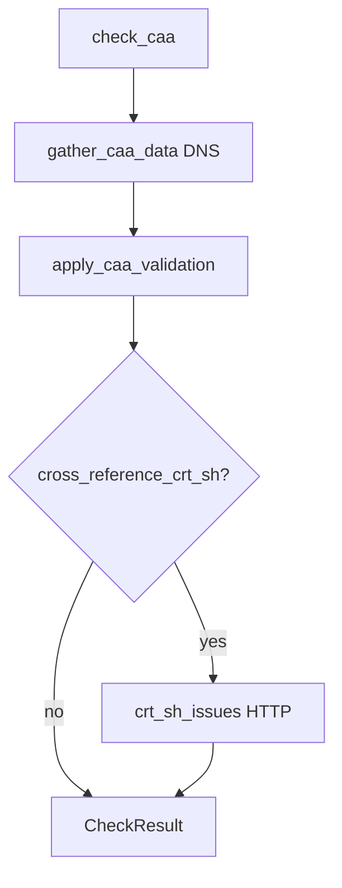
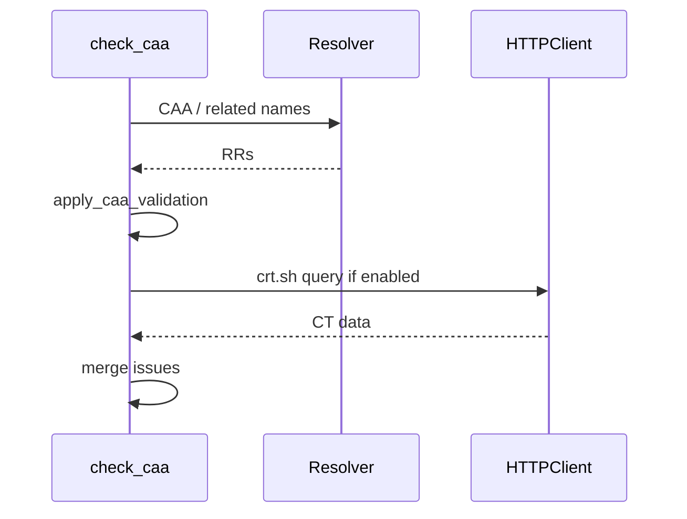

# CAA check

Normative behaviour: [checks-reference.md — CAA](../../../../.plan/v2/reference/checks-reference.md).

## Probe and validation order

1. **Inventory** — `gather_caa_data` enumerates CAA (and related names per config) via the resolver; builds wire-level view and `CAAData.names_checked`.
2. **Validation** — `apply_caa_validation` checks issuer/issue wildcards, syntax, policy vs config, and optional strict recommendations.
3. **crt.sh (optional)** — If `cross_reference_crt_sh` is enabled, `crt_sh_issues` uses HTTP to compare discovered issuers against certificate transparency.

DNS first, then pure validation, then optional HTTP cross-reference.

## Control flow (check)

## Sequence (crt.sh branch)

