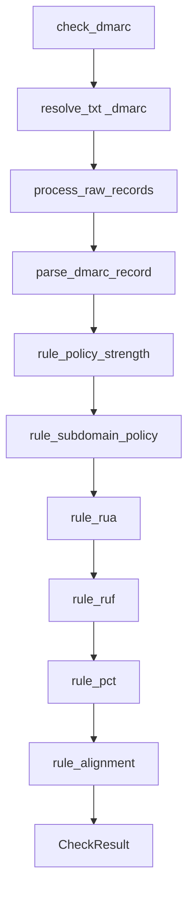

# DMARC check

**Ground truth:** This check’s code (`__init__.py`, `rules.py`, `models.py`), its config slice under [`core/schema/`](../../core/schema/), tests under [`tests/checks/`](../../../../tests/checks/), and YAML merge rules in [`core/config/parser/README.md`](../../core/config/parser/README.md). Repo-wide conventions: [`AGENTS.md`](../../../../AGENTS.md).

## Probe and validation order

1. **DNS** — Resolve `_dmarc.<domain>` `TXT`.
2. **Select** — `process_raw_records` picks a `v=DMARC1` record and flags multiple-record issues.
3. **Parse** — `parse_dmarc_record` builds `DMARCData` from tags.
4. **Rules** — Sequential rules: policy strength, subdomain policy, RUA, RUF, pct, alignment — each returns issues/recommendations using descriptor-backed severities.

`get_dmarc` fetches and parses one record. `check_dmarc` adds validation for missing/invalid DNS (dedicated partial results) then runs the rule list.

## Control flow (check)

