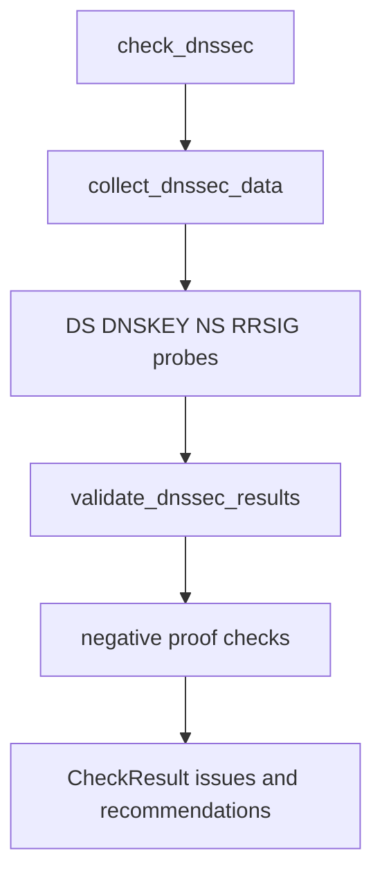

# DNSSEC check

Normative behaviour: [checks-reference.md — DNSSEC](../../../../.plan/v2/reference/checks-reference.md).

## Probe and validation order

1. **Collect** — `collect_dnssec_data` queries DS, DNSKEY, NS, and DNSSEC-related records for the zone; aggregates probe messages (e.g. DNSKEY/NS resolution notes).
2. **Validate** — `validate_dnssec_results` evaluates chain of trust, algorithm strength, RRSIG validity/expiry, NS presence, and negative proofs (NSEC/NSEC3) using the gathered data and zone name.

`get_dnssec` runs collection only. `check_dnssec` runs collection then validation rules.

## Control flow (check)

