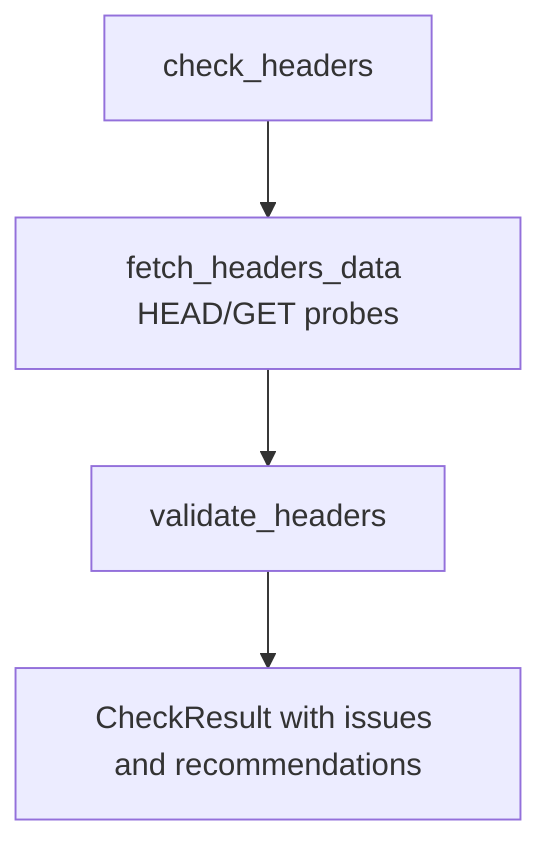
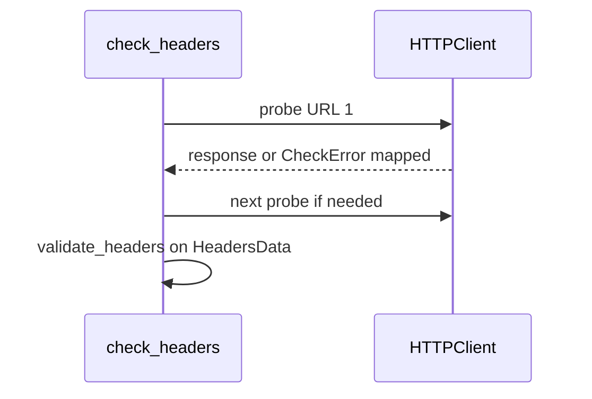

# HTTP security headers check

Normative behaviour: [checks-reference.md — Headers](../../../../.plan/v2/reference/checks-reference.md).

## Probe and validation order

1. **Probe URLs** — `fetch_headers_data` tries configured HTTPS (and fallbacks) with the shared HTTP client; records response headers or fetch error in `HeadersData`.
2. **Validate** — `validate_headers` evaluates required tokens (HSTS, CSP, etc.) against config and builds per-token `HeaderResult` entries inside the result.

`HeadersData` holds the full fetch outcome; each `HeaderResult` is one policy token’s pass/fail state.

## Control flow (check)

## Sequence (HTTP ordering)

