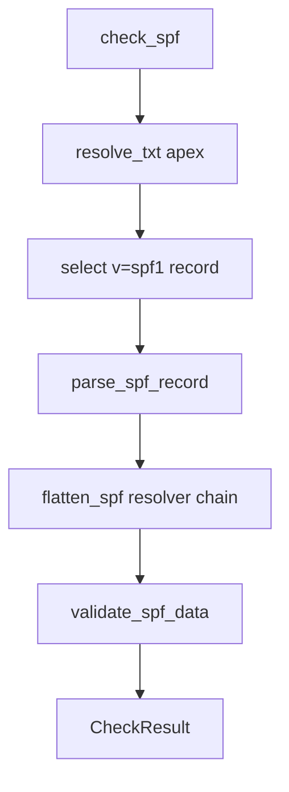

# SPF check

Normative behaviour and field semantics: [checks-reference.md — SPF](../../../../.plan/v2/reference/checks-reference.md) (search for SPF).

## Probe and validation order

1. **DNS** — Resolve apex `TXT` for the domain; keep strings that start with `v=spf1`.
2. **Parse** — `parse_spf_record` splits mechanisms, terminal disposition (`+all` / `~all` / …), and `include:` targets.
3. **Flatten** — `flatten_spf` walks `include:` / `redirect=` with resolver lookups up to the configured limit; builds `FlattenedSPF` (lookup count, resolved view).
4. **Validate** — `validate_spf_data` applies config (required disposition, lookup limit, redirect policy, syntax) and emits issues/recommendations.

`check_spf` follows **get path** (fetch → parse → flatten) then **validate**. `get_spf` stops after building `SPFData` (including flattened view when DNS succeeds).

## Control flow (check)

## Public parse API

`parse_spf_record` is exported from `dnsight.checks.spf` and exposed as `SPFCheck.parse_spf_record`, matching the DMARC parse pattern.
